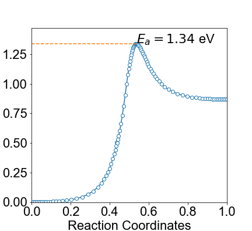
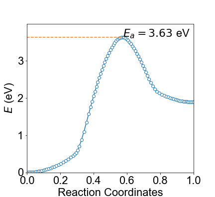
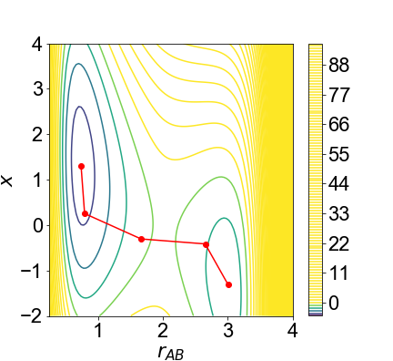
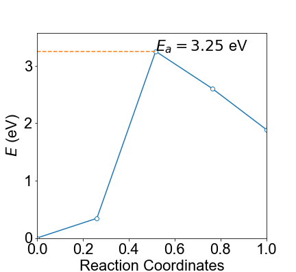
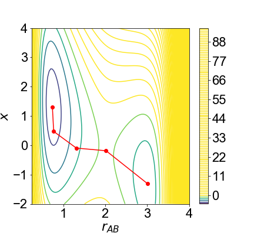
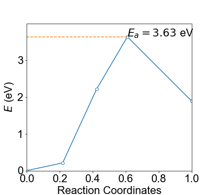

# Minimum Energy Path Tools

## Introduction 
This package contains various methods for finding the minimal energy path in atom simulations.

Currently the following methods are implemented:

> Nudged elastic band method [1]
> Climbing image nudged elastic band method [2]

## How to use

### Regular NEB
```python

from mep.optimize import ScipyOptimizer
from mep.path import Path
from mep.neb import NEB
from mep.models import LEPS

leps = LEPS() # Test model 
op = ScipyOptimizer(leps) # local optimizer for finding local minima
x0 = op.minimize([1, 4], bounds=[[0, 4], [-2, 4]]).x # minima one
x1 = op.minimize([3, 1], bounds=[[0, 4], [-2, 4]]).x # minima two


path = Path.from_linear_end_points(x0, x1, 101, 1)  # set 101 images, and k=1
neb =NEB(leps, path) # initialize NEB
history = neb.run(verbose=True) # run

```

The results will be like the following

  


Similar results can be obtained using the LEPS model with harmonics `LEPSHarm`

  

### CI-NEB
Every thing is the same except that 
```python
neb =NEB(leps, path, climbing=True, n_climbs=1) # set one image for climbing
history = neb.run(verbose=True, n_steps=10, n_climb_steps=100) # run normal NEB for 10 steps and then switch to CINEB
```

For comparison, normal NEB using `LEPSHarm` potential with 5 images gives the following

  

With CINEB 

  

We can see that using only 5 images, the CINEB gets `Ea = 3.63 eV`, the same as the one we ran with 101 images!
With only normal NEB, however, this `Ea` value is substantially smaller (`3.25 eV`). 
## References

[1] Henkelman, G., & Jónsson, H. (2000). Improved tangent estimate in the nudged elastic band method for finding minimum energy paths and saddle points. The Journal of chemical physics, 113(22), 9978-9985.
[2] Henkelman, G., Uberuaga, B. P., & Jónsson, H. (2000). A climbing image nudged elastic band method for finding saddle points and minimum energy paths. The Journal of chemical physics, 113(22), 9901-9904.